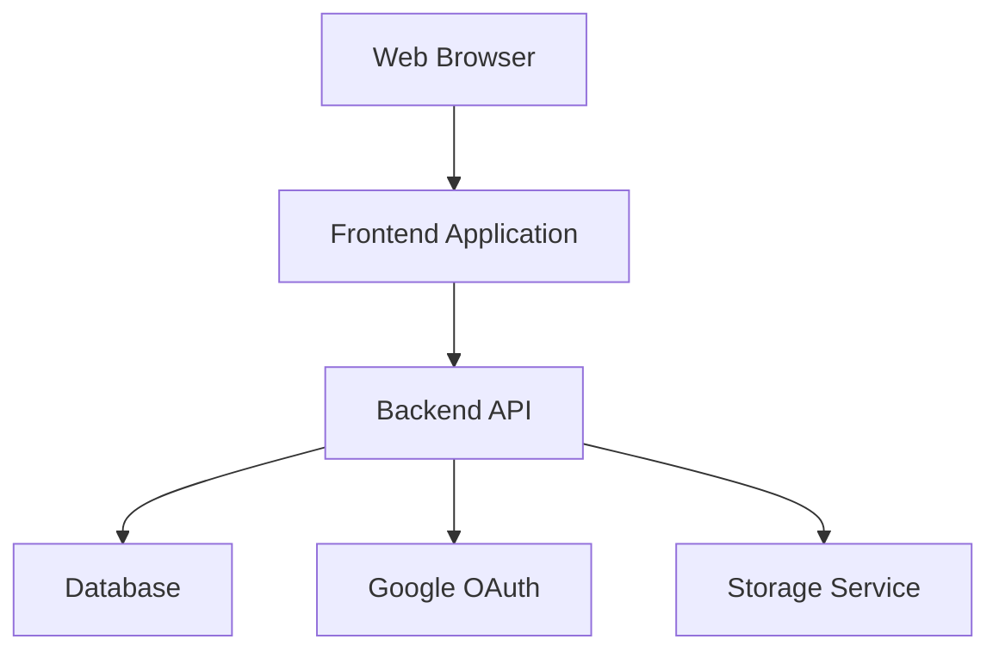
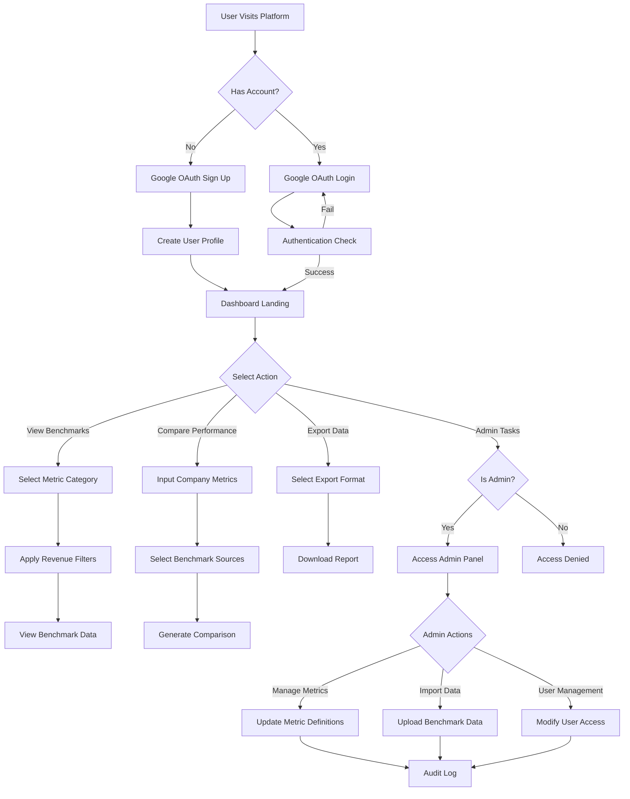
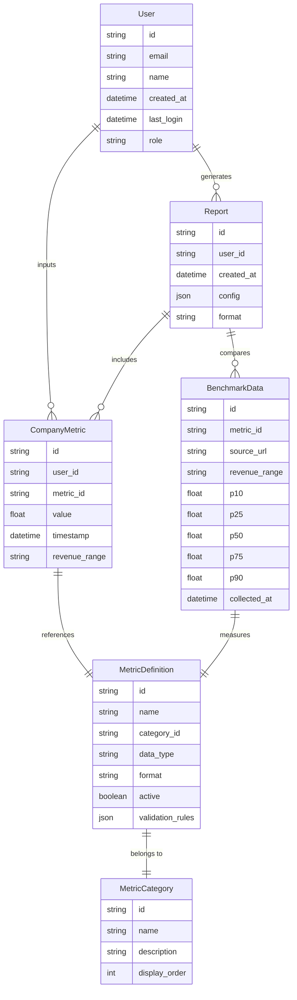
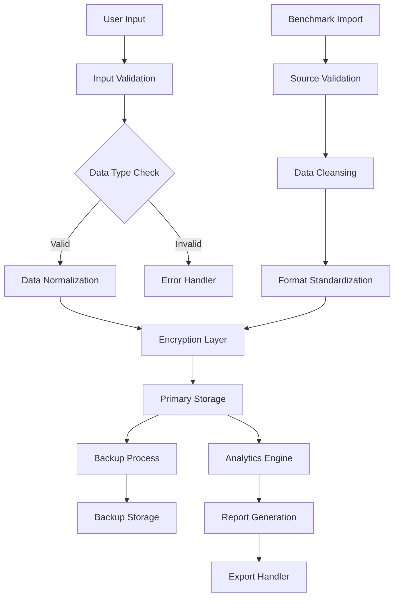
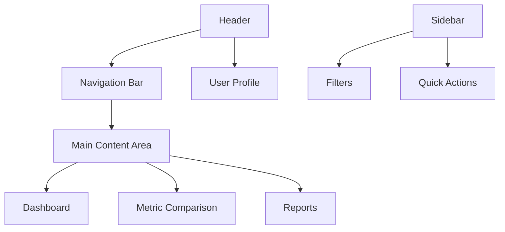
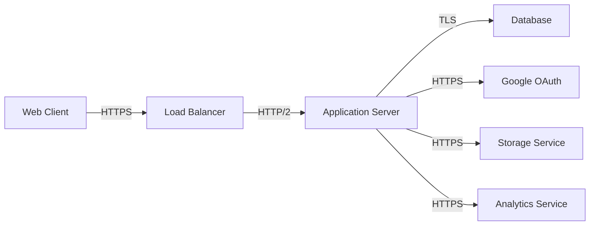

# Product Requirements Document (PRD)

# 1. INTRODUCTION

## 1.1 Purpose

This Product Requirements Document (PRD) serves as the authoritative reference for the development of a web-based startup metrics benchmarking platform. It is intended for:

- Development teams implementing the technical solution
- Product managers overseeing feature development
- UX/UI designers creating the interface
- QA teams validating functionality
- Stakeholders evaluating project progress

## 1.2 Scope

The platform enables startup founders and executives to:

- Access comprehensive benchmark data across key startup metrics
- Compare their company's performance against industry standards
- Filter and analyze data by revenue ranges
- Visualize metrics through interactive charts and dashboards
- Export customized reports for offline analysis

Core functionalities include:

- Google OAuth-based authentication system
- Interactive metric comparison tools
- Multi-source benchmark data management
- Administrative controls for metric and data handling
- Customizable data visualization system
- Revenue-based filtering capabilities
- Brand-aligned interface using specified color palette
- Export functionality for reports and visualizations
- Role-based access control
- Audit logging and monitoring

The platform will be developed as a web application with:

- Frontend: Modern web technologies supporting interactive visualizations
- Backend: Secure API infrastructure managing authentication and data
- Database: Optimized storage for benchmark data and user metrics
- Admin Interface: Comprehensive tools for platform management

# 2. PRODUCT DESCRIPTION

## 2.1 Product Perspective

The startup metrics benchmarking platform operates as a standalone web application while integrating with the following external systems:

- Google OAuth for authentication and user management
- Cloud-based data storage for benchmark information
- API endpoints for data import/export capabilities
- Web browsers as the primary client interface

The system architecture follows a modern web application structure:



## 2.2 Product Functions

The platform provides these core functions:

1. **Benchmark Data Access**
   - View industry metrics across revenue ranges
   - Filter and sort benchmark data
   - Compare multiple data sources

2. **Performance Analysis**
   - Input company metrics
   - Generate comparative visualizations
   - Calculate percentile rankings

3. **Data Management**
   - Import benchmark datasets
   - Validate data integrity
   - Maintain metric definitions

4. **Reporting**
   - Create custom reports
   - Export visualizations
   - Download raw data

5. **Administration**
   - Manage user access
   - Configure metrics
   - Monitor system usage

## 2.3 User Characteristics

### Primary Users: Startup Founders and Executives
- Technical proficiency: Moderate to high
- Data analysis experience: Intermediate
- Time availability: Limited
- Primary needs: Quick insights and comparisons

### Secondary Users: Financial Analysts
- Technical proficiency: High
- Data analysis experience: Advanced
- Time availability: Moderate
- Primary needs: Detailed analysis and reporting

### Administrative Users
- Technical proficiency: High
- System knowledge: Advanced
- Primary needs: Platform management and maintenance

## 2.4 Constraints

### Technical Constraints
- Must be compatible with modern web browsers (Chrome, Firefox, Safari, Edge)
- Response time for data visualizations under 2 seconds
- Maximum file size for data imports: 50MB
- Must support concurrent users up to 1000

### Regulatory Constraints
- GDPR compliance required for EU users
- CCPA compliance for California users
- Data retention policies must be configurable
- Regular security audits required

### Business Constraints
- Must integrate with existing Google OAuth implementation
- Platform must be accessible via Replit development environment
- Development timeline limited to 6 months
- Must maintain brand consistency

## 2.5 Assumptions and Dependencies

### Assumptions
1. Users have stable internet connections
2. Benchmark data sources remain available and structured consistently
3. Google OAuth remains the primary authentication method
4. Modern web browsers support required visualization libraries

### Dependencies
1. Google OAuth API availability and stability
2. Third-party benchmark data providers
3. Cloud infrastructure services
4. Data visualization libraries
5. Browser compatibility with modern web standards

# 3. PROCESS FLOWCHART



# 4. FUNCTIONAL REQUIREMENTS

## 4.1 Authentication System

### ID: F001
### Description: Google OAuth-based user authentication and authorization system
### Priority: High

| Requirement ID | Requirement Description | Acceptance Criteria |
|---------------|------------------------|-------------------|
| F001.1 | Implement Google OAuth 2.0 login flow | - Successful redirect to Google login<br>- Proper handling of OAuth tokens<br>- Secure session creation |
| F001.2 | Create user profiles from Google data | - Automatic profile creation with Google info<br>- Proper storage of user metadata<br>- Handle missing Google profile data |
| F001.3 | Manage user sessions | - Session timeout after 30 minutes<br>- Secure token storage<br>- Proper session cleanup |
| F001.4 | Handle authentication errors | - Clear error messages<br>- Graceful failure handling<br>- Retry mechanisms |

## 4.2 Benchmark Data Management

### ID: F002
### Description: System for importing, storing, and managing benchmark data from multiple sources
### Priority: High

| Requirement ID | Requirement Description | Acceptance Criteria |
|---------------|------------------------|-------------------|
| F002.1 | Import benchmark data | - Support CSV/Excel formats<br>- Validate data structure<br>- Handle duplicate entries |
| F002.2 | Store multiple data sources | - Maintain source attribution<br>- Version control<br>- Data integrity checks |
| F002.3 | Update existing benchmarks | - Partial updates supported<br>- Audit trail creation<br>- Validation checks |
| F002.4 | Archive outdated data | - Automated archival process<br>- Maintain historical records<br>- Data restoration capability |

## 4.3 Metric Comparison Engine

### ID: F003
### Description: Tool for comparing user metrics against benchmark data
### Priority: High

| Requirement ID | Requirement Description | Acceptance Criteria |
|---------------|------------------------|-------------------|
| F003.1 | Input company metrics | - Support all metric types<br>- Data validation<br>- Format enforcement |
| F003.2 | Calculate comparisons | - Accurate percentile calculation<br>- Multiple source comparison<br>- Performance optimization |
| F003.3 | Generate visualizations | - Interactive charts<br>- Brand color compliance<br>- Responsive design |
| F003.4 | Filter by revenue range | - Accurate range filtering<br>- Handle edge cases<br>- Clear UI indicators |

## 4.4 Report Generation

### ID: F004
### Description: System for creating and exporting custom reports
### Priority: Medium

| Requirement ID | Requirement Description | Acceptance Criteria |
|---------------|------------------------|-------------------|
| F004.1 | Create custom reports | - Template selection<br>- Metric customization<br>- Layout options |
| F004.2 | Export visualizations | - Multiple format support (PDF, PNG)<br>- High-resolution output<br>- Maintain branding |
| F004.3 | Download raw data | - CSV/Excel export<br>- Data formatting<br>- Source attribution |
| F004.4 | Schedule reports | - Automated generation<br>- Email delivery<br>- Error handling |

## 4.5 Administrative Controls

### ID: F005
### Description: Interface for platform administration and management
### Priority: Medium

| Requirement ID | Requirement Description | Acceptance Criteria |
|---------------|------------------------|-------------------|
| F005.1 | Manage users | - CRUD operations<br>- Role assignment<br>- Access control |
| F005.2 | Configure metrics | - Add/edit metrics<br>- Set validation rules<br>- Define categories |
| F005.3 | Monitor system usage | - Usage statistics<br>- Performance metrics<br>- Error logging |
| F005.4 | Manage data sources | - Source validation<br>- Update frequency control<br>- Quality checks |

## 4.6 Data Visualization System

### ID: F006
### Description: Interactive visualization system for benchmark data
### Priority: High

| Requirement ID | Requirement Description | Acceptance Criteria |
|---------------|------------------------|-------------------|
| F006.1 | Generate charts | - Multiple chart types<br>- Interactive elements<br>- Responsive design |
| F006.2 | Customize visualizations | - Color scheme options<br>- Layout control<br>- Label customization |
| F006.3 | Handle data updates | - Real-time updates<br>- Smooth transitions<br>- Error handling |
| F006.4 | Export capabilities | - High-quality export<br>- Multiple formats<br>- Maintain interactivity |

# 5. NON-FUNCTIONAL REQUIREMENTS

## 5.1 Performance Requirements

| Category | Requirement | Target Metric |
|----------|------------|---------------|
| Response Time | Dashboard loading | < 2 seconds |
| Response Time | Chart rendering | < 1 second |
| Response Time | Data export generation | < 5 seconds |
| Throughput | Concurrent users | 1000 users |
| Resource Usage | CPU utilization | < 70% under normal load |
| Resource Usage | Memory usage | < 4GB per instance |
| Database | Query response time | < 100ms |
| API Calls | Response time | < 200ms |

## 5.2 Safety Requirements

| Requirement | Description | Implementation |
|-------------|-------------|----------------|
| Data Backup | Regular automated backups | Daily incremental, weekly full |
| Failover | System redundancy | Multi-zone deployment |
| Data Recovery | Recovery point objective | < 24 hours |
| Data Recovery | Recovery time objective | < 4 hours |
| Error Handling | Graceful degradation | Fallback UI components |
| System Monitoring | Real-time monitoring | Alert thresholds defined |
| Incident Response | Response time | < 1 hour for critical issues |

## 5.3 Security Requirements

| Category | Requirement | Specification |
|----------|------------|---------------|
| Authentication | Google OAuth 2.0 | Secure token management |
| Authorization | Role-based access | Admin, User roles defined |
| Data Encryption | In-transit | TLS 1.3 |
| Data Encryption | At-rest | AES-256 |
| Session Management | Token expiration | 30 minutes |
| API Security | Rate limiting | 100 requests/minute |
| Audit Logging | Security events | Comprehensive logging |
| Vulnerability Management | Security scanning | Weekly automated scans |

## 5.4 Quality Requirements

### 5.4.1 Availability
- System uptime: 99.9%
- Planned maintenance windows: < 4 hours/month
- Unplanned downtime: < 8 hours/year

### 5.4.2 Maintainability
- Code coverage: > 80%
- Documentation: Comprehensive API docs
- Deployment time: < 30 minutes
- Rollback capability: < 15 minutes

### 5.4.3 Usability
- Learning curve: < 1 hour for basic features
- Error messages: Clear, actionable
- Mobile responsiveness: All core features
- Accessibility: WCAG 2.1 Level AA

### 5.4.4 Scalability
- Horizontal scaling: Auto-scaling enabled
- Vertical scaling: Support for larger instances
- Data volume: Support for 10TB
- User growth: 100% yearly increase

### 5.4.5 Reliability
- Mean time between failures: > 720 hours
- Mean time to recovery: < 4 hours
- Error rate: < 0.1% of requests
- Data accuracy: 99.99%

## 5.5 Compliance Requirements

| Requirement | Description | Implementation |
|-------------|-------------|----------------|
| GDPR | EU data protection | Data privacy controls |
| CCPA | California privacy | User consent management |
| SOC 2 | Security controls | Annual certification |
| HIPAA | Health data protection | If applicable |
| Data Retention | Policy enforcement | Configurable periods |
| User Privacy | Rights management | Data deletion capability |
| Audit Trail | Compliance logging | Immutable records |
| Export Control | Data jurisdiction | Regional data centers |

# 6. DATA REQUIREMENTS

## 6.1 Data Models

### 6.1.1 Entity Relationship Diagram



## 6.2 Data Storage

### 6.2.1 Primary Storage
- PostgreSQL database for structured data
- Document store for report templates and configurations
- Object storage for exported reports and large datasets

### 6.2.2 Data Retention
- Active user data: Indefinite retention
- Inactive user data: 24-month retention
- Benchmark data: 5-year rolling window
- System logs: 12-month retention
- Audit trails: 7-year retention

### 6.2.3 Backup Strategy
- Daily incremental backups
- Weekly full backups
- Cross-region backup replication
- 30-day backup retention period
- Point-in-time recovery capability

### 6.2.4 Data Redundancy
- Multi-region database replication
- Active-passive failover configuration
- 99.99% data durability guarantee
- Automatic failover within 60 seconds

## 6.3 Data Processing

### 6.3.1 Data Flow Diagram



### 6.3.2 Data Security
- AES-256 encryption at rest
- TLS 1.3 encryption in transit
- Row-level security in database
- Encrypted backup storage
- Key rotation every 90 days

### 6.3.3 Data Processing Rules
- Metric validation based on type:
  - Percentages: 0-100 range
  - Currency: Non-negative values
  - Ratios: Defined range limits
- Automatic currency normalization to USD
- Percentile calculations using linear interpolation
- Outlier detection and flagging
- Source data verification against known ranges

### 6.3.4 Data Quality Controls
- Automated data validation pipelines
- Duplicate detection and resolution
- Missing value handling protocols
- Data consistency checks
- Regular data quality audits

### 6.3.5 Data Access Controls
- Role-based access control (RBAC)
- IP-based access restrictions
- API rate limiting
- Audit logging of all data access
- Time-based access expiration

# 7. EXTERNAL INTERFACES

## 7.1 User Interfaces

### 7.1.1 Web Application Interface

The platform's user interface must follow these specifications:

| Component | Requirements |
|-----------|--------------|
| Resolution Support | Minimum 1024x768, optimized for 1920x1080 |
| Browser Compatibility | Chrome 90+, Firefox 88+, Safari 14+, Edge 90+ |
| Responsive Design | Breakpoints at 768px, 992px, 1200px |
| Color Scheme | Deep Navy (#151e2d), Ocean Blue (#46608C), Forest Green (#168947), Sage Green (#DBEAAC), Deep Teal (#0D3330) |
| Typography | System fonts with fallbacks for optimal performance |

### 7.1.2 Layout Components



### 7.1.3 Accessibility Requirements
- WCAG 2.1 Level AA compliance
- Keyboard navigation support
- Screen reader compatibility
- Minimum contrast ratio 4.5:1
- Focus indicators for interactive elements

## 7.2 Software Interfaces

### 7.2.1 Authentication Service

| Interface | Specification |
|-----------|--------------|
| Provider | Google OAuth 2.0 |
| Protocol | HTTPS |
| Data Format | JSON |
| Authentication Flow | OAuth 2.0 Authorization Code |
| Scope | email, profile |

### 7.2.2 Database Interface

| Component | Specification |
|-----------|--------------|
| Database | PostgreSQL 13+ |
| Connection Pool | 10-50 connections |
| Query Timeout | 30 seconds |
| SSL Mode | Required |
| Connection String | Environment variable based |

### 7.2.3 Storage Service Interface

| Feature | Specification |
|---------|--------------|
| Service | Cloud Storage |
| Access Control | IAM roles |
| Encryption | Server-side AES-256 |
| Content Types | PDF, CSV, PNG, XLSX |
| Max File Size | 50MB |

## 7.3 Communication Interfaces

### 7.3.1 API Specifications

| Aspect | Requirement |
|--------|-------------|
| Protocol | HTTPS |
| API Style | RESTful |
| Data Format | JSON |
| Authentication | Bearer Token |
| Rate Limiting | 100 requests/minute |
| Timeout | 10 seconds |

### 7.3.2 Network Requirements

| Requirement | Specification |
|-------------|--------------|
| Bandwidth | Minimum 1Mbps per user |
| Latency | < 200ms |
| Protocol | TLS 1.3 |
| Ports | 443 (HTTPS) |
| WebSocket | Supported for real-time updates |

### 7.3.3 Integration Points



## 7.4 Error Handling Interface

### 7.4.1 Error Response Format

```json
{
  "error": {
    "code": "string",
    "message": "string",
    "details": "object",
    "timestamp": "ISO8601",
    "requestId": "string"
  }
}
```

### 7.4.2 Status Codes

| Code | Usage |
|------|--------|
| 200 | Successful operation |
| 400 | Bad request |
| 401 | Unauthorized |
| 403 | Forbidden |
| 404 | Resource not found |
| 429 | Too many requests |
| 500 | Internal server error |

# 8. APPENDICES

## 8.1 GLOSSARY

| Term | Definition |
|------|------------|
| Annual Recurring Revenue (ARR) | The yearly value of subscription-based revenue normalized to a 12-month period |
| Net Dollar Retention (NDR) | Measure of revenue retained from existing customers including expansions and contractions |
| Logo Retention | Percentage of customers retained over a specific time period |
| Customer Acquisition Cost (CAC) | Total cost required to acquire a new customer |
| Gross Margins | Revenue minus cost of goods sold, expressed as a percentage |
| Annual Contract Value (ACV) | Average annualized revenue per customer contract |
| CAC Payback Period | Time required to recover the cost of acquiring a customer |
| Pipeline Coverage | Ratio of pipeline opportunities to revenue target |
| Magic Number | Measure of sales efficiency calculated as net new ARR divided by sales and marketing spend |
| Percentile | Statistical measure indicating the value below which a given percentage of observations falls |

## 8.2 ACRONYMS

| Acronym | Expansion |
|---------|-----------|
| API | Application Programming Interface |
| ARR | Annual Recurring Revenue |
| ACV | Annual Contract Value |
| CAC | Customer Acquisition Cost |
| CCPA | California Consumer Privacy Act |
| CI/CD | Continuous Integration/Continuous Deployment |
| CSV | Comma-Separated Values |
| GDPR | General Data Protection Regulation |
| G&A | General and Administrative |
| IAM | Identity and Access Management |
| NDR | Net Dollar Retention |
| NTM | Next Twelve Months |
| OAuth | Open Authorization |
| PRD | Product Requirements Document |
| RBAC | Role-Based Access Control |
| R&D | Research and Development |
| S&M | Sales and Marketing |
| SSL | Secure Sockets Layer |
| TLS | Transport Layer Security |
| UI/UX | User Interface/User Experience |
| WCAG | Web Content Accessibility Guidelines |
| YoY | Year over Year |

## 8.3 ADDITIONAL REFERENCES

| Resource | Description | URL |
|----------|-------------|-----|
| Google OAuth Documentation | Official documentation for implementing Google OAuth 2.0 | https://developers.google.com/identity/protocols/oauth2 |
| PostgreSQL Documentation | Reference for database implementation | https://www.postgresql.org/docs/ |
| WCAG Guidelines | Web accessibility standards and implementation guide | https://www.w3.org/WAI/standards-guidelines/wcag/ |
| GDPR Compliance | Official EU GDPR compliance documentation | https://gdpr.eu/compliance/ |
| Replit Documentation | Development environment setup and best practices | https://docs.replit.com/ |
| Data Visualization Libraries | Technical documentation for recommended visualization tools | Various vendor-specific URLs |
| Security Best Practices | OWASP security implementation guidelines | https://owasp.org/www-project-web-security-testing-guide/ |

## 8.4 REVISION HISTORY

| Version | Date | Author | Description of Changes |
|---------|------|---------|----------------------|
| 1.0 | Initial | Product Team | Initial document creation |
| 1.1 | TBD | Product Team | Addition of detailed metric definitions |
| 1.2 | TBD | Product Team | Updated compliance requirements |
| 1.3 | TBD | Product Team | Enhanced data visualization specifications |