# Technical Specifications

# 1. INTRODUCTION

## 1.1 EXECUTIVE SUMMARY

The Startup Metrics Benchmarking Platform is a web-based solution designed to provide founders and executives with comprehensive benchmark data across key startup performance metrics. By leveraging data from multiple industry sources and providing intuitive comparison tools, the platform enables startups to evaluate their performance against industry standards within specific revenue ranges.

The system addresses the critical challenge of fragmented and inconsistent benchmark data in the startup ecosystem by consolidating multiple data sources into a single, authoritative platform with standardized metrics and sophisticated visualization capabilities. Primary stakeholders include startup founders, financial analysts, and administrators, with an expected impact of improved strategic decision-making through data-driven insights.

## 1.2 SYSTEM OVERVIEW

### Project Context

| Aspect | Description |
|--------|-------------|
| Market Position | First-to-market comprehensive startup metrics benchmarking platform with multi-source data integration |
| Current Limitations | Existing solutions offer single-source data without comparative analysis capabilities |
| Enterprise Integration | Standalone platform with Google OAuth integration for authentication |

### High-Level Description

The system architecture comprises:

- Frontend web application with interactive visualizations
- Secure backend API infrastructure
- Multi-source benchmark data management system
- Administrative control interface
- Report generation engine

Key technical decisions include:

- Google OAuth for authentication
- Cloud-based infrastructure for scalability
- Real-time data processing capabilities
- Role-based access control system

### Success Criteria

| Criterion | Target Metric |
|-----------|--------------|
| User Adoption | 1000+ active users within 6 months |
| Data Accuracy | 99.9% accuracy in benchmark calculations |
| System Performance | < 2 second response time for all operations |
| User Satisfaction | > 90% positive feedback on core features |

## 1.3 SCOPE

### In-Scope Elements

#### Core Features

| Feature Category | Components |
|-----------------|------------|
| Authentication | - Google OAuth integration<br>- Role-based access control<br>- Session management |
| Data Management | - Multi-source benchmark data integration<br>- Data validation and normalization<br>- Version control |
| Visualization | - Interactive charts and dashboards<br>- Custom report generation<br>- Export capabilities |
| Administration | - User management<br>- Metric configuration<br>- System monitoring |

#### Implementation Boundaries

| Boundary Type | Coverage |
|--------------|----------|
| User Groups | - Startup founders<br>- Financial analysts<br>- System administrators |
| Geographic Scope | Global access with US-based data centers |
| Data Domains | - Financial metrics<br>- Growth metrics<br>- Operational metrics |
| Technical Coverage | - Web browser access<br>- Cloud infrastructure<br>- API integrations |

### Out-of-Scope Elements

- Mobile native applications
- Offline mode functionality
- Real-time data streaming
- Custom benchmark data collection
- Third-party API integrations beyond Google OAuth
- Historical data beyond 5 years
- Machine learning-based predictions
- Custom metric creation by end users

# 2. SYSTEM ARCHITECTURE

## 2.1 High-Level Architecture

The Startup Metrics Benchmarking Platform follows a modern cloud-native architecture optimized for scalability, reliability, and maintainability.

### 2.1.1 System Context Diagram (Level 0)

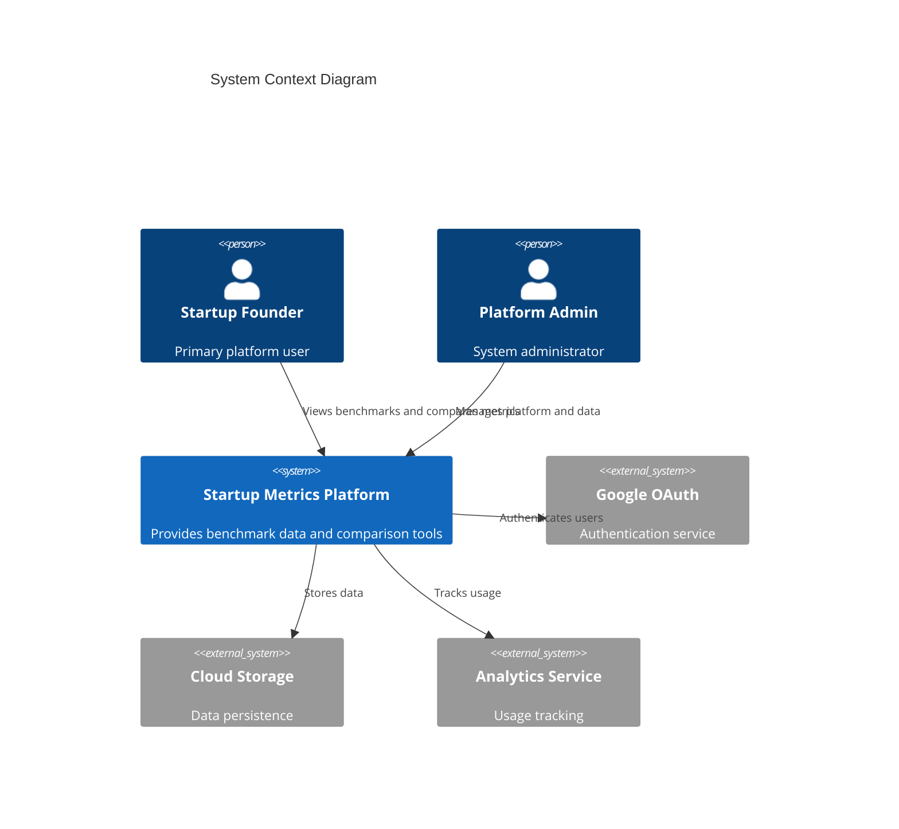

### 2.1.2 Container Diagram (Level 1)

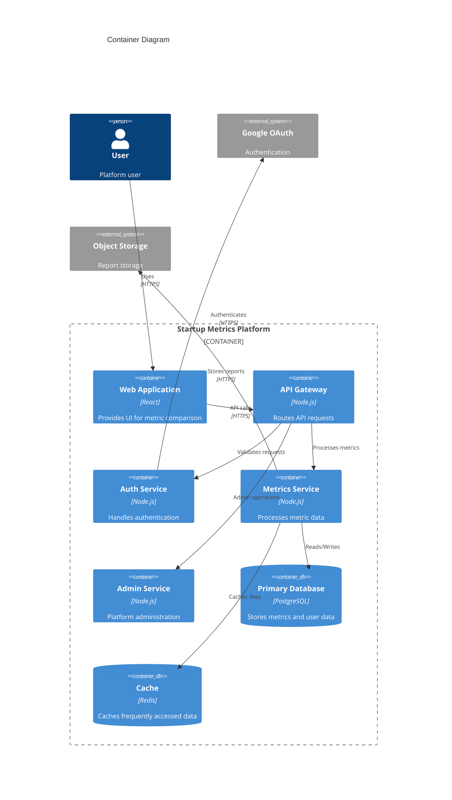

## 2.2 Component Details

### 2.2.1 Web Application
- **Technology**: React with TypeScript
- **Purpose**: Provides interactive user interface
- **Key Features**:
  - Interactive metric dashboards
  - Data visualization components
  - Form handling and validation
  - Real-time updates via WebSocket

### 2.2.2 API Gateway
- **Technology**: Node.js with Express
- **Purpose**: Routes and validates API requests
- **Features**:
  - Request validation
  - Rate limiting
  - Request logging
  - Response caching

### 2.2.3 Component Diagram (Level 2)

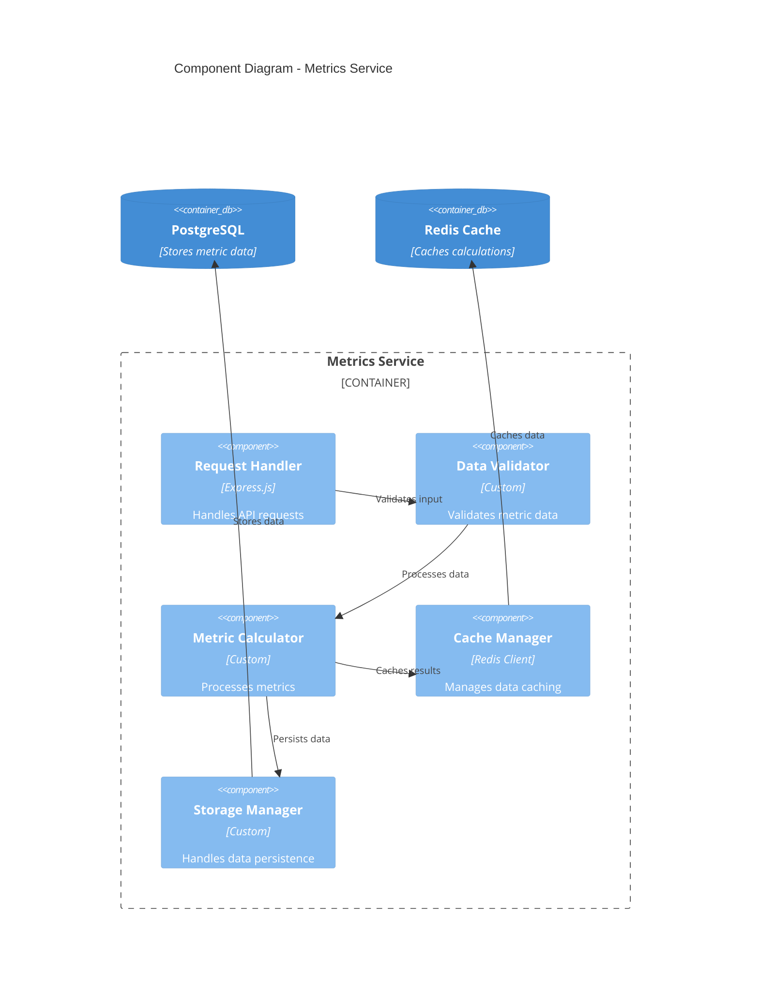

## 2.3 Technical Decisions

### 2.3.1 Architecture Style
- **Choice**: Microservices-based architecture
- **Rationale**:
  - Independent scaling of components
  - Technology flexibility
  - Improved fault isolation
  - Easier maintenance and updates

### 2.3.2 Data Flow Diagram

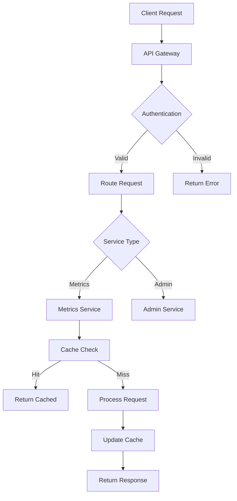

### 2.3.3 Deployment Diagram

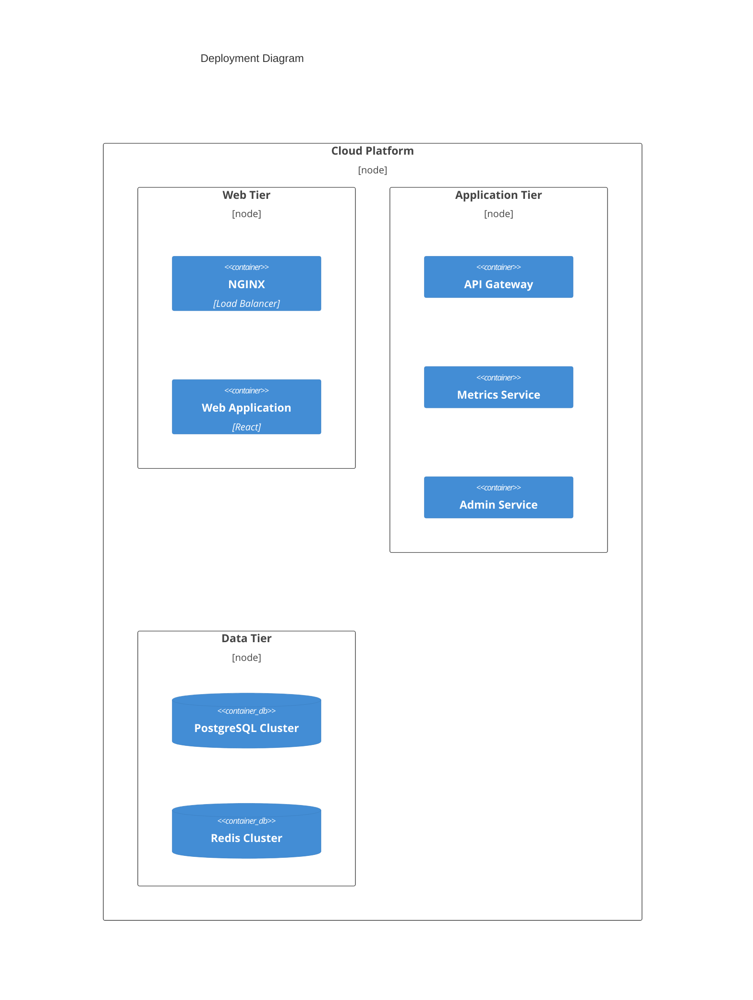

## 2.4 Cross-Cutting Concerns

### 2.4.1 Monitoring and Observability
- Distributed tracing using OpenTelemetry
- Metrics collection via Prometheus
- Centralized logging with ELK stack
- Real-time alerting system

### 2.4.2 Security Architecture
- JWT-based authentication
- Role-based access control
- Data encryption at rest and in transit
- Regular security scanning
- API rate limiting

### 2.4.3 Performance Requirements
- Response time < 200ms for API requests
- 99.9% uptime SLA
- Support for 1000+ concurrent users
- Automatic scaling based on load

### 2.4.4 Disaster Recovery
- Multi-region deployment capability
- Automated backup systems
- Failover procedures
- Recovery time objective (RTO): 4 hours
- Recovery point objective (RPO): 1 hour

## 2.5 Infrastructure Requirements

| Component | Specification | Scaling Strategy |
|-----------|--------------|------------------|
| Web Tier | t3.medium instances | Horizontal auto-scaling |
| Application Tier | t3.large instances | Horizontal auto-scaling |
| Database | db.r5.xlarge | Vertical scaling with read replicas |
| Cache | cache.r5.large | Cluster with auto-scaling |
| Load Balancer | Application Load Balancer | N+1 redundancy |
| Object Storage | S3 Standard | Automatic scaling |

# 3. SYSTEM COMPONENTS ARCHITECTURE

## 3.1 USER INTERFACE DESIGN

### 3.1.1 Design System Specifications

| Component | Specification | Implementation Details |
|-----------|--------------|----------------------|
| Typography | System fonts | - Primary: Inter<br>- Secondary: -apple-system<br>- Fallback: sans-serif |
| Color Palette | Brand colors | - Primary: Deep Navy (#151e2d)<br>- Secondary: Ocean Blue (#46608C)<br>- Accent: Forest Green (#168947) |
| Spacing | 8px grid system | Base unit: 8px<br>Increments: 8, 16, 24, 32, 48, 64px |
| Breakpoints | Responsive | - Mobile: 320px<br>- Tablet: 768px<br>- Desktop: 1024px<br>- Wide: 1440px |
| Accessibility | WCAG 2.1 AA | - Contrast ratio: 4.5:1<br>- Focus indicators<br>- ARIA labels |

### 3.1.2 Component Library

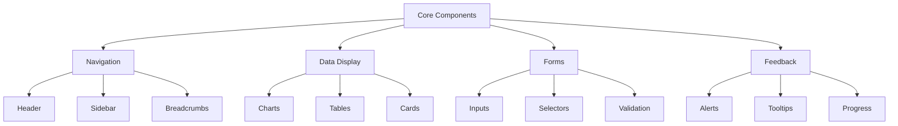

### 3.1.3 Critical User Flows

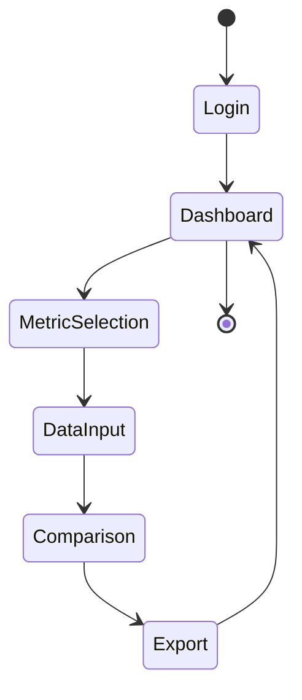

## 3.2 DATABASE DESIGN

### 3.2.1 Schema Design

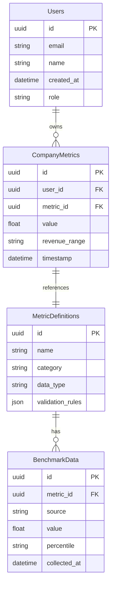

### 3.2.2 Data Management Strategy

| Aspect | Strategy | Implementation |
|--------|----------|----------------|
| Partitioning | Time-based | Monthly partitions for metrics data |
| Indexing | Selective | Covering indexes for common queries |
| Archival | Rolling window | 5-year retention with monthly archives |
| Backup | Incremental | Daily incrementals, weekly full backups |
| Encryption | At-rest | AES-256 encryption for sensitive data |

### 3.2.3 Performance Optimization

| Feature | Implementation | Details |
|---------|----------------|----------|
| Caching | Redis | - 15-minute TTL for benchmark data<br>- 1-hour TTL for aggregations |
| Replication | Master-slave | - One master, two read replicas<br>- Automatic failover |
| Scaling | Horizontal | Sharding by user_id for metrics data |
| Monitoring | Prometheus | Query performance and resource utilization |

## 3.3 API DESIGN

### 3.3.1 API Architecture

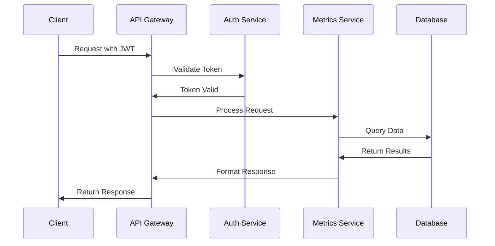

### 3.3.2 Endpoint Specifications

| Endpoint | Method | Purpose | Authentication |
|----------|---------|---------|----------------|
| /api/v1/metrics | GET | List available metrics | Required |
| /api/v1/metrics/{id} | GET | Get metric details | Required |
| /api/v1/benchmarks | GET | Get benchmark data | Required |
| /api/v1/companies/metrics | POST | Submit company metrics | Required |
| /api/v1/reports | GET | Generate reports | Required |

### 3.3.3 Authentication Flow

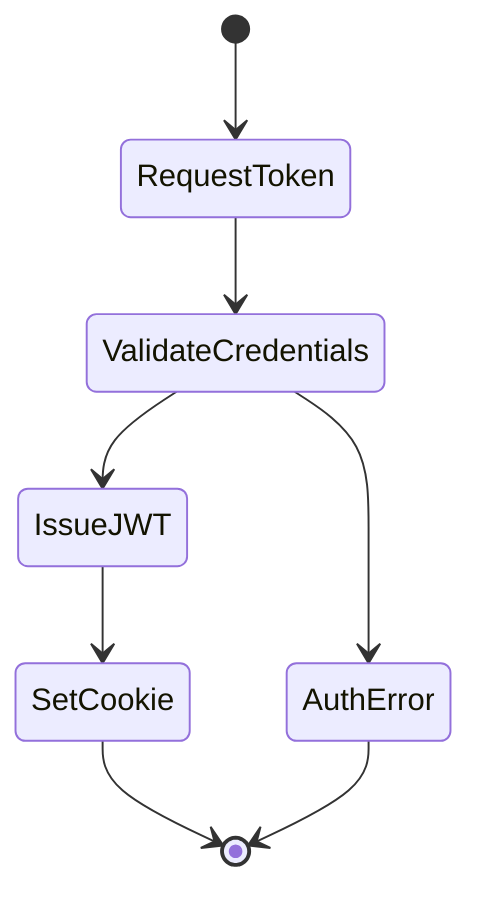

### 3.3.4 API Security Controls

| Control | Implementation | Details |
|---------|----------------|----------|
| Rate Limiting | Token bucket | 100 requests per minute per user |
| Authentication | JWT | RS256 signature, 1-hour expiration |
| Authorization | RBAC | Role-based access with scope validation |
| Input Validation | JSON Schema | Request payload validation |
| Error Handling | RFC 7807 | Problem Details for HTTP APIs |

### 3.3.5 Integration Requirements

| System | Integration Method | Details |
|--------|-------------------|----------|
| Google OAuth | OAuth 2.0 | User authentication |
| Analytics Service | REST API | Usage tracking |
| Storage Service | S3 API | Report storage |
| Monitoring | Prometheus | Performance metrics |

### 3.3.6 API Response Formats

```json
{
  "data": {
    "id": "string",
    "type": "string",
    "attributes": {},
    "relationships": {}
  },
  "meta": {
    "timestamp": "string",
    "version": "string"
  }
}
```

# 4. TECHNOLOGY STACK

## 4.1 PROGRAMMING LANGUAGES

| Component | Language | Version | Justification |
|-----------|----------|---------|---------------|
| Frontend | TypeScript | 4.9+ | - Strong typing for complex metric calculations<br>- Enhanced IDE support<br>- Better maintainability for large codebase |
| Backend | Node.js | 18 LTS | - Consistent JavaScript ecosystem<br>- Excellent async performance for API calls<br>- Rich package ecosystem for data processing |
| Database Scripts | SQL | PostgreSQL 14+ | - Complex metric aggregations<br>- Advanced data analysis capabilities<br>- Strong data integrity controls |

## 4.2 FRAMEWORKS & LIBRARIES

### 4.2.1 Frontend Framework Stack

| Framework/Library | Version | Purpose |
|------------------|---------|----------|
| React | 18.2+ | Core UI framework |
| Material-UI | 5.0+ | Component library matching brand design |
| D3.js | 7.0+ | Complex metric visualizations |
| React Query | 4.0+ | API data management |
| Redux Toolkit | 1.9+ | Global state management |

### 4.2.2 Backend Framework Stack

| Framework/Library | Version | Purpose |
|------------------|---------|----------|
| Express.js | 4.18+ | API framework |
| Prisma | 4.0+ | Database ORM |
| Jest | 29.0+ | Testing framework |
| Winston | 3.8+ | Logging system |
| Joi | 17.0+ | Request validation |

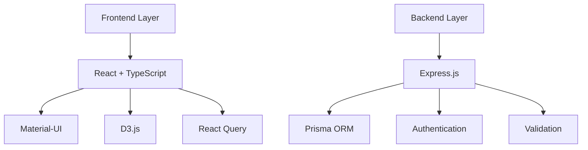

## 4.3 DATABASES & STORAGE

### 4.3.1 Primary Database

| Component | Technology | Purpose |
|-----------|------------|----------|
| RDBMS | PostgreSQL 14+ | Primary data store |
| Connection Pool | pg-pool | Connection management |
| Migrations | Prisma Migrate | Schema version control |

### 4.3.2 Caching Layer

| Component | Technology | Purpose |
|-----------|------------|----------|
| In-Memory Cache | Redis 6.2+ | Query result caching |
| Session Store | Redis | User session management |
| Cache Strategy | Write-through | Data consistency |

### 4.3.3 Storage Services

| Service | Purpose | Configuration |
|---------|----------|--------------|
| S3 Compatible | Report storage | - Versioning enabled<br>- Server-side encryption<br>- Lifecycle policies |
| PostgreSQL BLOB | Small attachments | - Max size: 1MB<br>- Compression enabled |

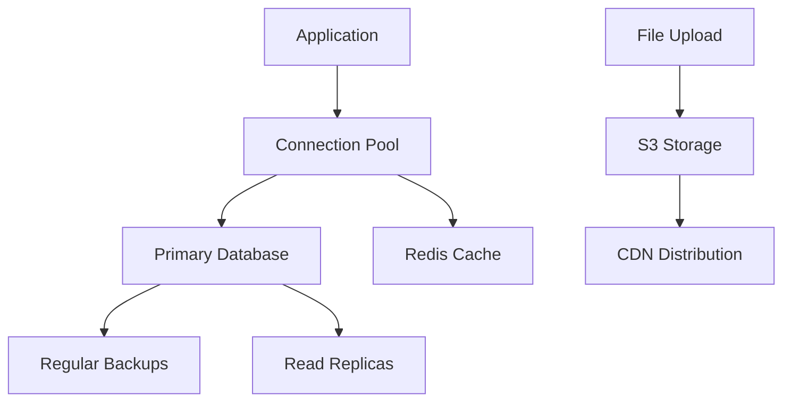

## 4.4 THIRD-PARTY SERVICES

| Service | Purpose | Integration Method |
|---------|----------|-------------------|
| Google OAuth 2.0 | Authentication | OAuth 2.0 protocol |
| AWS CloudWatch | Monitoring | SDK integration |
| Datadog | APM & Logging | Agent-based |
| SendGrid | Email delivery | REST API |

## 4.5 DEVELOPMENT & DEPLOYMENT

### 4.5.1 Development Environment

| Tool | Purpose | Version |
|------|----------|---------|
| VS Code | IDE | Latest |
| ESLint | Code linting | 8.0+ |
| Prettier | Code formatting | 2.0+ |
| Husky | Git hooks | 8.0+ |

### 4.5.2 Deployment Pipeline

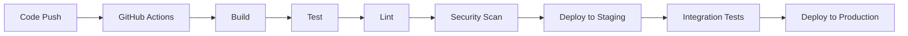

### 4.5.3 Infrastructure

| Component | Technology | Configuration |
|-----------|------------|---------------|
| Container Runtime | Docker | Multi-stage builds |
| Orchestration | Kubernetes | Auto-scaling enabled |
| Load Balancer | NGINX | SSL termination |
| CDN | CloudFront | Edge caching |

### 4.5.4 Monitoring Stack

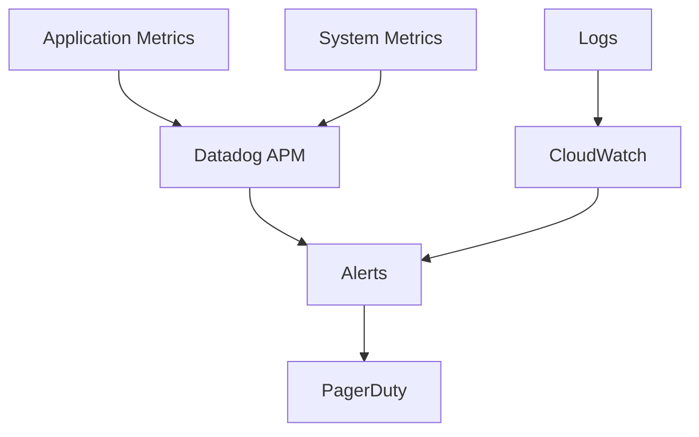

# 5. SYSTEM DESIGN

## 5.1 USER INTERFACE DESIGN

The platform's interface follows a modern dashboard layout with consistent branding elements and intuitive navigation.

### 5.1.1 Layout Structure

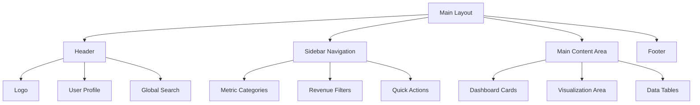

### 5.1.2 Component Specifications

| Component | Location | Functionality | Styling |
|-----------|----------|---------------|----------|
| Header | Top fixed | - Brand logo<br>- User profile<br>- Global search | - Height: 64px<br>- Background: Deep Navy (#151e2d)<br>- Text: White |
| Sidebar | Left fixed | - Navigation menu<br>- Metric filters<br>- Revenue range selector | - Width: 256px<br>- Background: White<br>- Accent: Ocean Blue (#46608C) |
| Content Area | Center fluid | - Metric cards<br>- Charts<br>- Data tables | - Responsive grid<br>- Padding: 24px<br>- Background: Light gray |
| Dashboard Cards | Content grid | - Metric value<br>- Trend indicator<br>- Comparison data | - Width: 300px<br>- Height: 200px<br>- Shadow: 0 2px 4px rgba(0,0,0,0.1) |

## 5.2 DATABASE DESIGN

### 5.2.1 Schema Design

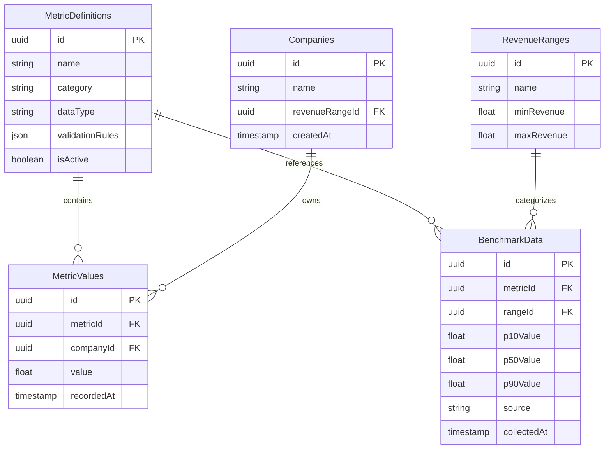

### 5.2.2 Indexing Strategy

| Table | Index | Type | Purpose |
|-------|-------|------|---------|
| MetricValues | (companyId, metricId) | Composite | Fast lookup of company metrics |
| MetricValues | recordedAt | B-tree | Time-based queries |
| BenchmarkData | (metricId, rangeId) | Composite | Benchmark lookups |
| Companies | revenueRangeId | B-tree | Revenue range filtering |

## 5.3 API DESIGN

### 5.3.1 REST Endpoints

| Endpoint | Method | Purpose | Request Body | Response |
|----------|---------|---------|--------------|-----------|
| /api/v1/metrics | GET | List metrics | N/A | Metric definitions |
| /api/v1/metrics/{id}/values | POST | Record metric | `{ value: float }` | Created metric value |
| /api/v1/benchmarks | GET | Get benchmarks | N/A | Benchmark data |
| /api/v1/companies/{id}/metrics | GET | Company metrics | N/A | Metric values |

### 5.3.2 API Flow

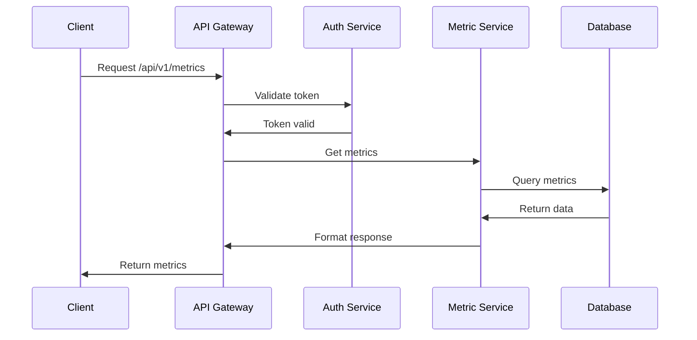

### 5.3.3 Response Format

```json
{
  "data": {
    "id": "uuid",
    "type": "metric",
    "attributes": {
      "name": "string",
      "value": "float",
      "timestamp": "ISO8601"
    },
    "relationships": {
      "company": {
        "data": { "id": "uuid", "type": "company" }
      }
    }
  },
  "meta": {
    "timestamp": "ISO8601",
    "version": "string"
  }
}
```

### 5.3.4 Error Handling

| Status Code | Scenario | Response Format |
|-------------|----------|-----------------|
| 400 | Invalid request | `{ "error": { "code": "INVALID_REQUEST", "message": "string" }}` |
| 401 | Unauthorized | `{ "error": { "code": "UNAUTHORIZED", "message": "string" }}` |
| 404 | Not found | `{ "error": { "code": "NOT_FOUND", "message": "string" }}` |
| 500 | Server error | `{ "error": { "code": "SERVER_ERROR", "message": "string" }}` |

# 6. USER INTERFACE DESIGN

## 6.1 Layout Structure

The platform follows a modern dashboard layout with fixed header and left sidebar navigation.

### 6.1.1 Base Layout Wireframe

```
+----------------------------------------------------------+
|[#] Company Logo    [@]Profile    [?]Help    [=]Settings   |
+------------------+-----------------------------------------+
|  NAVIGATION      |           MAIN CONTENT                  |
|                  |                                         |
| [#] Dashboard    |  +-----------------------------------+ |
| [$] Metrics      |  |         Quick Stats               | |
| [@] Compare      |  | ARR: $1.2M   Growth: 125% YoY    | |
| [^] Import       |  | NDR: 110%    CAC: $12,000        | |
| [*] Saved        |  +-----------------------------------+ |
| [?] Help         |                                       |
|                  |  +-----------------------------------+ |
|  FILTERS         |  |         Metric Charts             | |
|                  |  |  [Chart Area]                     | |
| Revenue Range:   |  |                                   | |
| [v] $1M-$5M     |  |                                   | |
|                  |  +-----------------------------------+ |
| Metrics:         |                                       |
| [x] Financial    |  +-----------------------------------+ |
| [ ] Growth       |  |         Benchmark Table           | |
| [ ] Sales        |  |  [Table Area]                    | |
|                  |  |                                   | |
+------------------+-----------------------------------------+
```

### 6.1.2 Metric Comparison View

```
+----------------------------------------------------------+
|                     METRIC COMPARISON                      |
+----------------------------------------------------------+
| Select Metric:  [v] Annual Recurring Revenue              |
| Your Value:     [...] $1,200,000                         |
|                                                          |
| Revenue Range:  [v] $1M - $5M                           |
|                                                          |
| +----------------------------------------------------+ |
| |                  BENCHMARK RESULTS                   | |
| |                                                     | |
| | Your Position: 75th Percentile                      | |
| |                                                     | |
| | [====================================]             | |
| | P25     P50          P75 ^    P90                 | |
| | $800K   $1M          $1.2M   $1.5M                | |
| |                                                     | |
| +----------------------------------------------------+ |
|                                                        |
| [Export PDF]  [Save View]  [Share Link]               |
+----------------------------------------------------------+
```

### 6.1.3 Data Input Form

```
+----------------------------------------------------------+
|                     ENTER METRICS                          |
+----------------------------------------------------------+
| Company Details:                                          |
| Revenue Range: ( ) <$1M  (x) $1M-$5M  ( ) $5M-$20M      |
|                                                          |
| Financial Metrics:                                       |
| +----------------------------------------------------+ |
| | ARR:             [...] $1,200,000              [$] | |
| | Growth Rate:      [...] 125                     [%] | |
| | Gross Margin:     [...] 80                     [%] | |
| | CAC:              [...] 12000                  [$] | |
| +----------------------------------------------------+ |
|                                                        |
| Retention Metrics:                                     |
| +----------------------------------------------------+ |
| | NDR:             [...] 110                     [%] | |
| | Logo Retention:   [...] 95                     [%] | |
| +----------------------------------------------------+ |
|                                                        |
| [Save Draft]                    [Submit Metrics]       |
+----------------------------------------------------------+
```

## 6.2 Component Legend

### Navigation Icons
- [#] Dashboard/Menu icon
- [$] Financial metrics
- [@] User/Profile
- [^] Upload/Import
- [*] Favorites/Saved
- [?] Help/Information
- [=] Settings
- [x] Close/Remove
- [<] [>] Navigation arrows

### Input Elements
- [...] Text input field
- [v] Dropdown selector
- ( ) Radio button
- [ ] Checkbox
- [Button] Action button
- [====] Progress/Scale indicator

### Content Areas
- +---+ Border/Container
- |   | Vertical separator
- +--- Tree/Hierarchy indicator

## 6.3 Responsive Breakpoints

The interface adapts to different screen sizes:

### Desktop (>1200px)
- Full sidebar visible
- Multi-column dashboard layout
- Complete metric tables

### Tablet (768px-1199px)
- Collapsible sidebar
- Two-column dashboard
- Scrollable tables

### Mobile (<767px)
- Hidden sidebar with hamburger menu
- Single column layout
- Simplified charts
- Stacked metric cards

## 6.4 Color System

Implements the brand color palette:
- Primary: Deep Navy (#151e2d)
- Secondary: Ocean Blue (#46608C)
- Accent: Forest Green (#168947)
- Background: Sage Green (#DBEAAC)
- Text: Deep Teal (#0D3330)

## 6.5 Typography

Hierarchy follows:
- Headers: Inter Bold
- Body: Inter Regular
- Metrics: Inter Mono
- Labels: Inter Medium

## 6.6 Interaction States

All interactive elements have defined states:
- Default: Normal state
- Hover: Subtle highlight
- Active: Clear indication
- Disabled: Muted appearance
- Error: Red highlight
- Success: Green confirmation

## 6.7 Accessibility Features

- ARIA labels on all interactive elements
- Keyboard navigation support
- High contrast mode support
- Screen reader compatibility
- Focus indicators
- Error announcements
- Skip navigation links

# 7. SECURITY CONSIDERATIONS

## 7.1 AUTHENTICATION AND AUTHORIZATION

### 7.1.1 Authentication Flow

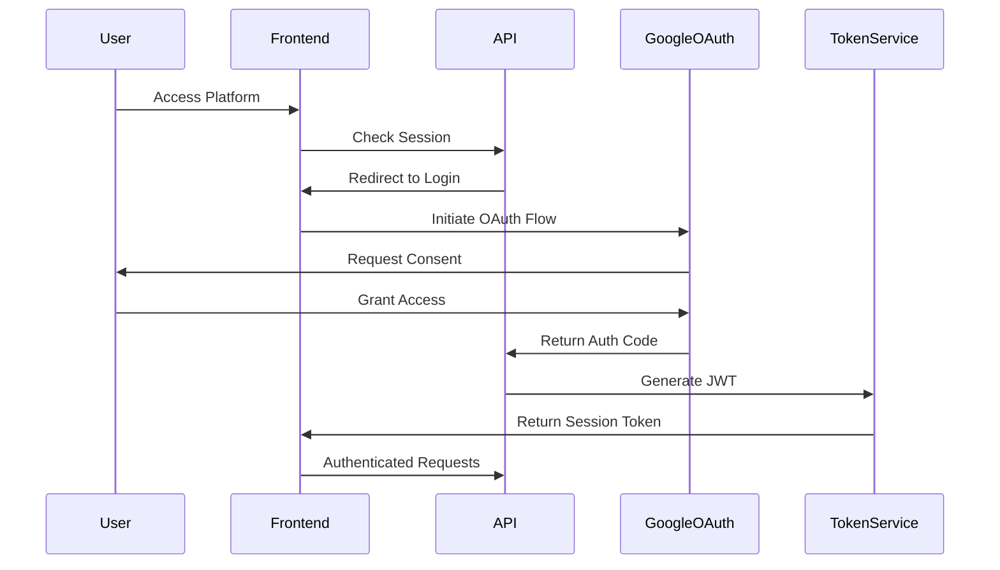

### 7.1.2 Authorization Levels

| Role | Permissions | Access Level |
|------|------------|--------------|
| Admin | - Full system access<br>- User management<br>- Metric configuration<br>- Benchmark data management | Full |
| Analyst | - View all metrics<br>- Create reports<br>- Export data<br>- Input company metrics | High |
| User | - View assigned metrics<br>- Basic comparisons<br>- Personal dashboard | Limited |
| Guest | - Public benchmarks only<br>- No data input<br>- No exports | Minimal |

### 7.1.3 Session Management

| Feature | Implementation | Details |
|---------|----------------|----------|
| Token Type | JWT (RS256) | 1-hour expiration |
| Refresh Mechanism | Sliding Session | 30-day maximum |
| Concurrent Sessions | Limited | 3 per user |
| Session Termination | Automatic | After 30 minutes idle |

## 7.2 DATA SECURITY

### 7.2.1 Encryption Standards

| Layer | Method | Implementation |
|-------|---------|----------------|
| Data at Rest | AES-256 | Database and file storage |
| Data in Transit | TLS 1.3 | All network communications |
| API Payloads | JWE | Sensitive data transmission |
| Backup Data | AES-256 | With separate key management |

### 7.2.2 Data Classification

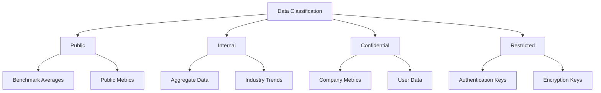

### 7.2.3 Data Protection Measures

| Category | Measure | Implementation |
|----------|---------|----------------|
| Access Control | Row-Level Security | PostgreSQL RLS policies |
| Data Masking | Dynamic Masking | Sensitive field obfuscation |
| Audit Logging | Comprehensive | All data access tracked |
| Data Retention | Configurable | Based on data classification |

## 7.3 SECURITY PROTOCOLS

### 7.3.1 Security Headers

| Header | Value | Purpose |
|--------|-------|---------|
| Content-Security-Policy | strict-dynamic | XSS protection |
| X-Frame-Options | DENY | Clickjacking prevention |
| X-Content-Type-Options | nosniff | MIME type enforcement |
| Strict-Transport-Security | max-age=31536000 | Force HTTPS |
| X-XSS-Protection | 1; mode=block | XSS filtering |

### 7.3.2 Security Monitoring

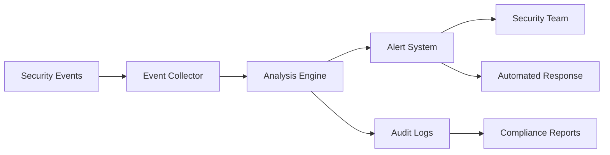

### 7.3.3 Security Controls

| Control | Implementation | Frequency |
|---------|----------------|-----------|
| Vulnerability Scanning | Automated tools | Weekly |
| Penetration Testing | Third-party | Quarterly |
| Security Updates | Automated patching | As available |
| Access Review | Manual audit | Monthly |
| Security Training | Employee education | Quarterly |

### 7.3.4 Incident Response

| Phase | Actions | Responsibility |
|-------|---------|----------------|
| Detection | - Log analysis<br>- Alert triggering<br>- Anomaly detection | Security monitoring system |
| Assessment | - Impact evaluation<br>- Scope determination<br>- Risk classification | Security team |
| Containment | - Threat isolation<br>- Access restriction<br>- System protection | DevOps team |
| Resolution | - Threat elimination<br>- System recovery<br>- Service restoration | Development team |
| Review | - Incident analysis<br>- Process improvement<br>- Documentation update | Security & management team |

### 7.3.5 Compliance Requirements

| Requirement | Implementation | Validation |
|-------------|----------------|------------|
| GDPR | - Data minimization<br>- Right to erasure<br>- Privacy controls | Annual audit |
| CCPA | - Data disclosure<br>- Opt-out mechanisms<br>- Access controls | Quarterly review |
| SOC 2 | - Security controls<br>- Availability measures<br>- Confidentiality | Annual certification |
| PCI DSS | - If applicable<br>- Payment data handling<br>- Cardholder protection | Quarterly assessment |

# 8. INFRASTRUCTURE

## 8.1 DEPLOYMENT ENVIRONMENT

The platform utilizes a cloud-native deployment strategy to ensure scalability, reliability, and maintainability.

| Environment | Purpose | Configuration |
|-------------|---------|---------------|
| Development | Local development and testing | - Replit-compatible environment<br>- Local Docker containers<br>- Development database |
| Staging | Pre-production testing and validation | - Cloud-based replica of production<br>- Reduced resource allocation<br>- Test data subset |
| Production | Live system serving end users | - High-availability configuration<br>- Auto-scaling enabled<br>- Full resource allocation |

### Environment Architecture

```mermaid
graph TD
    subgraph Production
        A[Load Balancer] --> B[Web Tier]
        B --> C[Application Tier]
        C --> D[Database Tier]
        C --> E[Cache Tier]
    end
    
    subgraph Staging
        F[Load Balancer] --> G[Web Tier]
        G --> H[Application Tier]
        H --> I[Database Tier]
        H --> J[Cache Tier]
    end
    
    subgraph Development
        K[Local Environment] --> L[Docker Compose]
        L --> M[Local Services]
    end
```

## 8.2 CLOUD SERVICES

The platform leverages AWS services for optimal performance and reliability.

| Service | Purpose | Configuration |
|---------|---------|---------------|
| EKS | Kubernetes management | - Multi-AZ deployment<br>- Managed node groups<br>- Auto-scaling enabled |
| RDS | PostgreSQL database | - Multi-AZ deployment<br>- Read replicas<br>- Automated backups |
| ElastiCache | Redis caching | - Cluster mode enabled<br>- Multi-AZ replication<br>- Auto-recovery |
| S3 | Object storage | - Versioning enabled<br>- Lifecycle policies<br>- Cross-region replication |
| CloudFront | CDN | - Edge locations worldwide<br>- HTTPS enforcement<br>- Cache optimization |
| Route 53 | DNS management | - Health checks<br>- Failover routing<br>- Latency-based routing |

## 8.3 CONTAINERIZATION

Docker containers are used for consistent deployment across environments.

### Container Strategy

```mermaid
graph LR
    A[Base Image] --> B[Development Image]
    A --> C[Production Image]
    
    B --> D[Dev Container]
    C --> E[Prod Container]
    
    subgraph Images
        B
        C
    end
    
    subgraph Containers
        D
        E
    end
```

### Container Specifications

| Component | Base Image | Optimizations |
|-----------|------------|---------------|
| Frontend | node:18-alpine | - Multi-stage builds<br>- Production dependencies only<br>- Minimized image size |
| Backend | node:18-alpine | - Multi-stage builds<br>- Security scanning<br>- Health checks |
| Database | postgres:14-alpine | - Custom configuration<br>- Optimized settings<br>- Backup utilities |
| Cache | redis:6.2-alpine | - Persistence configuration<br>- Memory optimization<br>- Cluster settings |

## 8.4 ORCHESTRATION

Kubernetes is used for container orchestration with the following configuration:

### Cluster Architecture

```mermaid
graph TD
    A[EKS Control Plane] --> B[Node Group 1]
    A --> C[Node Group 2]
    A --> D[Node Group 3]
    
    subgraph "Node Group 1"
        B1[Frontend Pods]
        B2[Frontend Pods]
    end
    
    subgraph "Node Group 2"
        C1[Backend Pods]
        C2[Backend Pods]
    end
    
    subgraph "Node Group 3"
        D1[Service Pods]
        D2[Service Pods]
    end
```

### Kubernetes Resources

| Resource | Configuration | Purpose |
|----------|--------------|----------|
| Deployments | - Rolling updates<br>- Auto-scaling<br>- Health checks | Application workloads |
| Services | - Load balancing<br>- Service discovery<br>- External access | Network connectivity |
| ConfigMaps | - Environment variables<br>- Configuration files<br>- Feature flags | Application configuration |
| Secrets | - Credentials<br>- Certificates<br>- API keys | Sensitive data |

## 8.5 CI/CD PIPELINE

Automated pipeline using GitHub Actions for continuous integration and deployment.

### Pipeline Flow

```mermaid
graph LR
    A[Code Push] --> B[Build]
    B --> C[Test]
    C --> D[Security Scan]
    D --> E[Package]
    E --> F[Deploy to Staging]
    F --> G[Integration Tests]
    G --> H[Deploy to Production]
    
    subgraph "Quality Gates"
        C
        D
        G
    end
```

### Pipeline Stages

| Stage | Tools | Actions |
|-------|-------|---------|
| Build | - GitHub Actions<br>- Docker | - Code compilation<br>- Asset building<br>- Container creation |
| Test | - Jest<br>- Cypress | - Unit tests<br>- Integration tests<br>- E2E tests |
| Security | - SonarQube<br>- OWASP ZAP | - Code analysis<br>- Vulnerability scanning<br>- Dependency checks |
| Deploy | - Helm<br>- ArgoCD | - Chart updates<br>- Rolling deployments<br>- Automated rollbacks |
| Monitor | - Prometheus<br>- Grafana | - Performance metrics<br>- Health monitoring<br>- Alert management |

# APPENDICES

## A.1 ADDITIONAL TECHNICAL INFORMATION

### A.1.1 Metric Calculation Formulas

| Metric | Formula | Validation Rules |
|--------|---------|-----------------|
| Net Dollar Retention | (Starting ARR + Expansions - Contractions - Churn) / Starting ARR × 100 | Range: 0-200% |
| CAC Payback Period | CAC / (ARR × Gross Margin) × 12 | Range: 0-60 months |
| Magic Number | Net New ARR / Previous Quarter S&M Spend | Range: 0-10 |
| Pipeline Coverage | Total Pipeline Value / Revenue Target × 100 | Range: 0-1000% |
| Gross Margins | (Revenue - COGS) / Revenue × 100 | Range: -100-100% |

### A.1.2 Data Import Specifications

```mermaid
flowchart TD
    A[CSV Upload] --> B{File Validation}
    B -->|Valid| C[Header Mapping]
    B -->|Invalid| D[Error Report]
    C --> E{Data Validation}
    E -->|Pass| F[Data Transform]
    E -->|Fail| G[Validation Report]
    F --> H[Database Import]
    H --> I[Import Log]
```

### A.1.3 Cache Strategy

| Data Type | Cache Duration | Invalidation Trigger |
|-----------|---------------|---------------------|
| Benchmark Data | 24 hours | New data import |
| User Metrics | 15 minutes | Metric update |
| Report Templates | 1 hour | Template modification |
| Aggregated Stats | 30 minutes | New calculation |

## A.2 GLOSSARY

| Term | Definition |
|------|------------|
| Benchmark Data | Industry standard metrics collected from various sources for comparison |
| Cohort Analysis | Grouping and analyzing companies based on common characteristics |
| Data Normalization | Process of standardizing data formats and units for consistent comparison |
| Edge Computing | Distributed computing paradigm bringing computation closer to data sources |
| Horizontal Scaling | Adding more machines to handle increased load |
| Idempotency | Property where an operation can be applied multiple times without changing the result |
| Multi-tenancy | Architecture where a single instance serves multiple customers |
| Rate Limiting | Controlling the number of requests a user can make in a given timeframe |
| Vertical Scaling | Adding more power (CPU, RAM) to an existing machine |
| Zero-downtime Deployment | Deploying updates without service interruption |

## A.3 ACRONYMS

| Acronym | Full Form |
|---------|-----------|
| AES | Advanced Encryption Standard |
| APM | Application Performance Monitoring |
| CDN | Content Delivery Network |
| CORS | Cross-Origin Resource Sharing |
| CRUD | Create, Read, Update, Delete |
| DNS | Domain Name System |
| ELK | Elasticsearch, Logstash, Kibana |
| ETL | Extract, Transform, Load |
| JWT | JSON Web Token |
| ORM | Object-Relational Mapping |
| REST | Representational State Transfer |
| RTO | Recovery Time Objective |
| RPO | Recovery Point Objective |
| SLA | Service Level Agreement |
| SSO | Single Sign-On |
| TLS | Transport Layer Security |
| TTL | Time To Live |
| UUID | Universally Unique Identifier |
| VPC | Virtual Private Cloud |
| WAF | Web Application Firewall |

## A.4 SYSTEM MONITORING METRICS

```mermaid
graph TD
    A[System Metrics] --> B[Performance]
    A --> C[Resource Usage]
    A --> D[User Activity]
    A --> E[Security]

    B --> B1[Response Time]
    B --> B2[Throughput]
    B --> B3[Error Rate]

    C --> C1[CPU Usage]
    C --> C2[Memory Usage]
    C --> C3[Disk I/O]

    D --> D1[Active Users]
    D --> D2[API Calls]
    D --> D3[Data Exports]

    E --> E1[Failed Logins]
    E --> E2[Rate Limit Hits]
    E --> E3[Security Events]
```

## A.5 ERROR CODES AND HANDLING

| Error Code | Description | Recovery Action |
|------------|-------------|-----------------|
| AUTH001 | OAuth token expired | Redirect to login |
| AUTH002 | Invalid permissions | Display access denied |
| DATA001 | Invalid metric value | Show validation rules |
| DATA002 | Missing required field | Highlight missing field |
| SYS001 | Rate limit exceeded | Implement exponential backoff |
| SYS002 | Service unavailable | Retry with circuit breaker |
| API001 | Invalid API request | Show API documentation |
| API002 | Endpoint not found | Check API version |