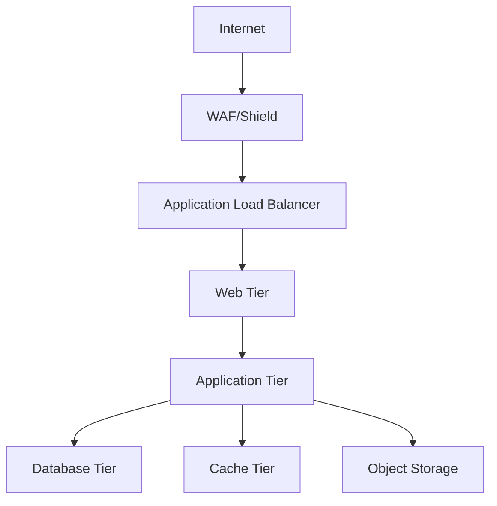

# Infrastructure Documentation
Comprehensive guide for setting up and maintaining the Startup Metrics Benchmarking Platform infrastructure.

## Infrastructure Overview

### Cloud Architecture
- **Provider**: AWS
- **Region**: Primary: us-east-1, DR: us-west-2
- **Architecture**: Microservices-based with containerized workloads
- **High Availability**: Multi-AZ deployment with N+1 redundancy

### Service Components
- **Web Tier**: t3.medium instances with auto-scaling
- **Application Tier**: t3.large instances with auto-scaling
- **Database**: db.r5.xlarge PostgreSQL with read replicas
- **Cache**: cache.r5.large Redis cluster
- **Storage**: S3 with lifecycle policies
- **Load Balancer**: Application Load Balancer with SSL termination

### Network Layout


## Prerequisites

### Required Tools and Versions
- Terraform >= 1.0.0
- AWS CLI >= 2.0
- kubectl >= 1.24
- Helm >= 3.0

### Access Credentials Setup
1. AWS IAM credentials with required permissions
2. KMS keys for encryption
3. SSL certificates for HTTPS
4. SSH keys for instance access

### Environment Configuration
```bash
# Required environment variables
export AWS_ACCESS_KEY_ID="your-access-key"
export AWS_SECRET_ACCESS_KEY="your-secret-key"
export AWS_DEFAULT_REGION="us-east-1"
export TF_VAR_environment="production"
```

## Infrastructure Setup

### Terraform Deployment Steps
1. Initialize Terraform:
```bash
terraform init -backend-config="bucket=startup-metrics-terraform-state"
```

2. Plan deployment:
```bash
terraform plan -out=tfplan
```

3. Apply infrastructure:
```bash
terraform apply tfplan
```

### Kubernetes Cluster Configuration
- EKS version: 1.24+
- Node groups: t3.large instances
- Auto-scaling: 2-5 nodes
- Monitoring: Prometheus/Grafana stack

### Database and Cache Setup
- PostgreSQL 14 with Multi-AZ deployment
- Redis 6.2 cluster mode enabled
- Automated backups and snapshots
- Point-in-time recovery enabled

## Monitoring and Logging

### Prometheus Setup
- Metrics collection interval: 15s
- Retention period: 15 days
- Alert manager integration
- Custom recording rules

### Grafana Dashboards
- Service health monitoring
- Resource utilization
- Business metrics
- Performance indicators

### Log Management
- CloudWatch Logs integration
- Log retention: 30 days
- Structured logging format
- Log aggregation pipeline

## Security Configuration

### Access Management
- IAM roles with least privilege
- RBAC for Kubernetes
- Network security groups
- VPC flow logs enabled

### Secret Management
- AWS KMS for encryption
- Kubernetes secrets
- SSL/TLS certificates
- Rotation policies

### Network Security
- VPC with private subnets
- Security groups and NACLs
- WAF rules
- DDoS protection

## Deployment Procedures

### Development Environment
- Single-AZ deployment
- Reduced capacity
- Local development support
- Integration testing

### Staging Environment
- Multi-AZ deployment
- Production-like setup
- Performance testing
- Security scanning

### Production Environment
- Full HA deployment
- Auto-scaling enabled
- DR configuration
- Compliance controls

## Maintenance

### Backup Procedures
- Database: Daily full backup, 5-minute transaction logs
- Configuration: Version controlled
- Secrets: Encrypted backups
- Application state: S3 replication

### Update Processes
1. Security patches: Automated with maintenance windows
2. Version upgrades: Coordinated with change management
3. Configuration changes: Through GitOps pipeline
4. Emergency fixes: Break-glass procedure

### Health Checks
- Endpoint monitoring
- Resource utilization
- Performance metrics
- Security scanning

## Troubleshooting

### Common Issues
1. Connection timeouts
   - Check security groups
   - Verify network ACLs
   - Validate DNS resolution

2. High latency
   - Monitor resource utilization
   - Check connection pooling
   - Verify cache hit rates

3. Memory pressure
   - Review garbage collection
   - Check memory limits
   - Analyze memory leaks

### Debug Procedures
1. Access logs
   ```bash
   kubectl logs -f deployment/service-name
   ```

2. Check metrics
   ```bash
   curl -X GET http://prometheus:9090/api/v1/query?query=up
   ```

3. Verify connectivity
   ```bash
   kubectl exec -it pod-name -- nc -zv service-name 80
   ```

### Support Contacts
- Infrastructure Team: infrastructure@startup-metrics.com
- Security Team: security@startup-metrics.com
- On-call Engineer: +1-555-0123 (24/7)

### Recovery Playbooks
1. Database failover
2. Cache cluster recovery
3. Application rollback
4. Network isolation
5. Security incident response